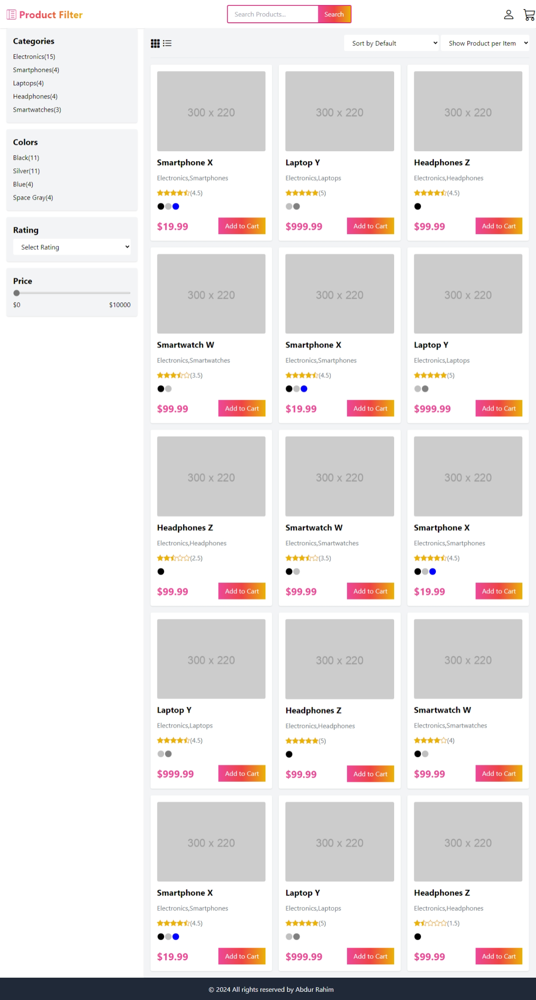

# Product Filter with vanila JS 

This is a simple product filter with vanila JS. built with HTML, tailwind CSS and JS. 


## How to use
- Clone the repository
```bash
git clone https://github.com/AbdurRaahimm/product-filter.git
```
- Navigate to the project directory
```bash
cd product-filter
```
- Open the vscode editor
```bash
code .
```
- You can also use live server to run the project

## Features
- Filter products by category
- Filter products by price range
- Filter products by search query
- Filter products by rating
- Filter products by color
- Sorted the products by price , low to high and high to low , rating , newess


## Screenshots


## Demo
[Product Filter](https://abdurraahimm.github.io/product-filter/)


## Author
- [Twitter](https://twitter.com/AbdurRahim4G)
- [Instagram](https://www.instagram.com/abdurrahim4g/)
- [Facebook](https://www.facebook.com/Rahim72446)
- [LinkedIn](https://www.linkedin.com/in/abdur-rahim4g/)
- [YouTube](https://youtube.com/@AbdurRahimm)
